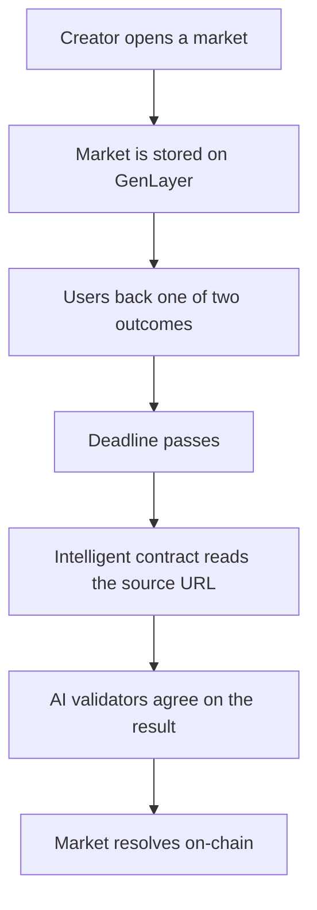

# Gen Predicts

Gen Predicts is a GenLayer prediction market app where users create factual markets, back outcomes with a test ERC20 token, and resolve markets through an intelligent Python contract that reads public source URLs.

## Deployed Contracts

| Contract | Address |
| --- | --- |
| UniversalPredictionMarket | `0x87bC6D1e5Ae83B8fe3e806b45Ffe96B4ED615924` |
| Plain ERC20 test token | `0x3c4fa9dBB58cc64FD31Aaef01a92f8875E26b577` |

## Core Flow



## Features

- GenLayer intelligent contract for source-based market resolution
- Two-option market creation with image/source metadata
- Test ERC20 token balance, minting, transfer, and betting helpers
- Dashboard views for markets, user bets, recent activity, and results
- Responsive product UI with a restrained dark landing page and cleaner market console

## Project Structure

```text
.
├── app/
│   ├── api/                  # Next.js API routes for markets, bets, balance, minting, results
│   ├── dashboard/            # Authenticated product routes
│   ├── globals.css           # Tailwind v4 theme and shared app styles
│   ├── layout.tsx            # Root metadata and providers
│   └── page.tsx              # Public landing page
├── components/
│   ├── market/               # Market creation, cards, and market grid
│   ├── metrics/              # Dashboard analytics widgets
│   ├── header/               # Wallet connection UI
│   └── ui/                   # Shared UI primitives
├── contracts/
│   ├── UniversalPredictionMarket.py
│   └── llm_erc20.py
├── context/                  # App state providers
├── hooks/                    # Client hooks
├── layout/                   # Dashboard shell
├── lib/                      # GenLayer client, token helpers, API helpers, utilities
└── public/                   # Static assets
```

## Environment

Create a local `.env.local` when running the app:

```env
GENLAYER_CONTRACT_ADDRESS=0x87bC6D1e5Ae83B8fe3e806b45Ffe96B4ED615924
ERC20_TOKEN_ADDRESS=0x3c4fa9dBB58cc64FD31Aaef01a92f8875E26b577
GENLAYER_RPC_URL=https://devconnect-25-studio.genlayer.com/api
NEXT_PUBLIC_GENLAYER_RPC_URL=https://rpc.genlayer.io
```

The app includes the deployed contract addresses as code fallbacks, so the environment variables are mainly for explicit deployment configuration.

## Local Development

```bash
pnpm install
pnpm dev
```

Open `http://localhost:3000`.

## Deployment Notes

- Deploy the frontend to Vercel or any Next.js compatible host.
- Set the environment variables above in the deployment dashboard.
- Keep `.genlayer-key.json`, `.env*`, `.next`, `node_modules`, and generated caches out of git.

## Contracts

`UniversalPredictionMarket.py` is the intelligent contract. It stores market metadata, accepts bets, reads the market resolution URL, asks GenLayer's AI execution layer to determine the factual outcome, and marks the market resolved when the result matches one of the valid options.

`llm_erc20.py` is the test token contract used for balances and market participation during demos.
